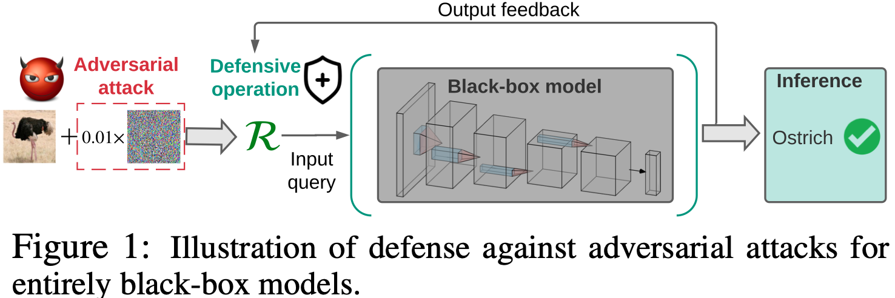
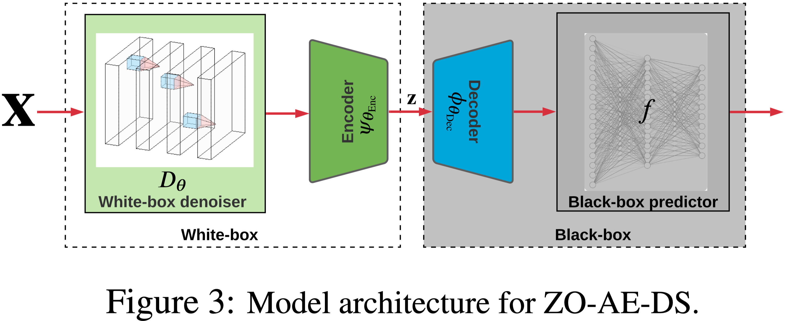
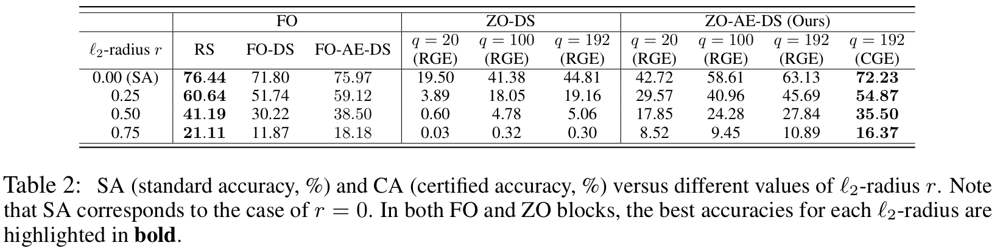
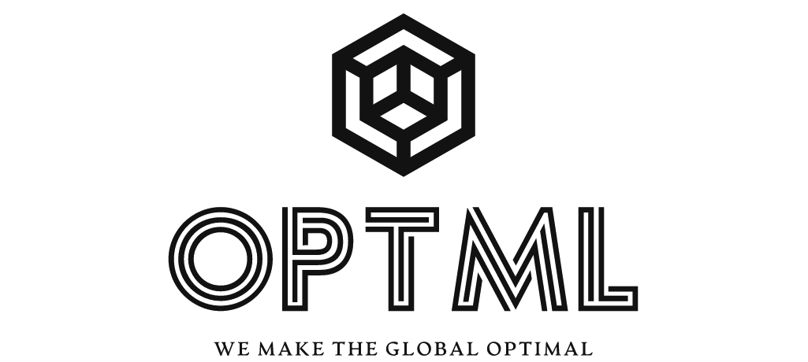

# Black-Box-Defense

This repository contains the code and models necessary to replicate the results of our recent paper:

**How to Robustify Black-Box ML Models? A Zeroth-Order Optimization Perspective** <br>
*[**Yimeng Zhang**](https://damon-demon.github.io), Yuguang Yao, Jinghan Jia, [Jinfeng Yi](https://jinfengyi.net), [Mingyi Hong](https://people.ece.umn.edu/~mhong/mingyi.html), [Shiyu Chang](https://engineering.ucsb.edu/people/shiyu-chang), [Sijia Liu](https://lsjxjtu.github.io)* <br>

**ICLR'22 (Spotlight)** <br>
Paper: https://openreview.net/forum?id=W9G_ImpHlQd <br>

We formulate the problem of black-box defense (as shown in Fig. 1) and investigate it through the lens of zeroth-order (ZO) optimization. Different from existing work, our paper aims to design the restriction-least black-box defense and our formulation is built upon a query-based black-box setting, which avoids the use of surrogate models.

<p>

</p>

We propose a novel black-box defense approach, **ZO AutoEncoder-based Denoised Smoothing (ZO-AE-DS)** as shown in Fig. 3, which is able to tackle the challenge of ZO optimization in high dimensions and convert a pre-trained non-robust ML model into a certifiably robust model using only function queries. 

To train ZO-AE-DS, we adopt a two-stage training protocol. **1) White-box pre-training on AE**: At the first stage, we pre-train the AE model by calling a standard FO optimizer (e.g., Adam) to minimize the reconstruction loss. The resulting AE will be used as the initialization of the second-stage training. We remark that the denoising model can also be pre-trained. However, such a pre-training could hamper optimization, i.e., making the second-stage training over θ easily trapped at a poor local optima. **2) End-to-end training**: At the second stage, we keep the pre-trained decoder intact and merge it into the black-box system.

<p>

</p>

The performance comparisons with baselines are shown in Table 2.
<p>

</p>

## Overview of the Repository

Our code is based on the open source codes of [Salmanet al.(2020)](https://github.com/microsoft/denoised-smoothing). Our repo contains the code for our experiments on MNIST, CIFAR-10, STL-10, and Restricted ImageNet.

Let us dive into the files:

1. `train_classifier.py`: a generic script for training ImageNet/Cifar-10 classifiers, with Gaussian agumentation option, achieving SOTA.
2. `AE_DS_train.py`: the main code of our paper which is used to train the different AE-DS/DS model with FO/ZO optimization methods used in our paper.
3. `AE_DS_certify.py`: Given a pretrained smoothed classifier, returns a certified L2-radius for each data point in a given dataset using the algorithm of [Cohen et al (2019)](https://github.com/locuslab/smoothing).
4. `architectures.py`: an entry point for specifying which model architecture to use per classifiers, denoisers and AutoEncoders.
5. [archs/](archs) contains the network architecture files.
6. [trained_models/](trained_models) contains the checkpoints of AE-DS and base classifiers.

## Getting Started
1.  `git clone https://github.com/damon-demon/Black-Box-Defense.git`

2.  Install dependencies:
    ```
    conda create -n Black_Box_Defense python=3.6
    conda activate Black_Box_Defense
    conda install numpy matplotlib pandas seaborn scipy==1.1.0
    conda install pytorch torchvision cudatoolkit=10.0 -c pytorch # for Linux
    ```
3.  Train a AE-DS model using Coordinate-Wise Gradient Estimation (CGE) for ZO optimization on CIFAR-10 Dataset.
    ```
    python3 AE_DS_train.py --model_type AE_DS --lr 1e-3 --outdir ZO_AE_DS_lr-3_q192_Coord --dataset cifar10 --arch cifar_dncnn --encoder_arch cifar_encoder_192_24 --decoder_arch cifar_decoder_192_24 --epochs 200 --train_method whole --optimization_method ZO --zo_method CGE --pretrained-denoiser $pretrained_denoiser  --pretrained-encoder $pretrained_encoder --pretrained-decoder $pretrained_decoder --classifier $pretrained_clf --noise_sd 0.25  --q 192
    ```
4.  Certify the robustness of a AE-DS model on CIFAR-10 dataset.
    ```
    python3 AE_DS_certify.py --dataset cifar10 --arch cifar_dncnn --encoder_arch cifar_encoder_192_24 --decoder_arch cifar_decoder_192_24 --base_classifier $pretrained_base_classifier --pretrained_denoiser $pretrained_denoiser  --pretrained-encoder $pretrained_encoder --pretrained-decoder $pretrained_decoder --sigma 0.25 --outfile ZO_AE_DS_lr-3_q192_Coord_NoSkip_CF_result/sigma_0.25 --batch 400 --N 10000 --skip 1 --l2radius 0.25
    ```
Check the results in `ZO_AE_DS_lr-3_q192_Coord_NoSkip_CF_result/sigma_0.25`.

## Citation

@inproceedings{  
zhang2022how,  
title={How to Robustify Black-Box {ML} Models? A Zeroth-Order Optimization Perspective},  
author={Yimeng Zhang and Yuguang Yao and Jinghan Jia and Jinfeng Yi and Mingyi Hong and Shiyu Chang and Sijia Liu},  
booktitle={International Conference on Learning Representations},  
year={2022},  
url={ https://openreview.net/forum?id=W9G_ImpHlQd }  
}

## Contact
For more information, contact [Yimeng(Damon) Zhang](mailto:zhan1853@msu.edu) with any additional questions or comments.
<p>

</p>
